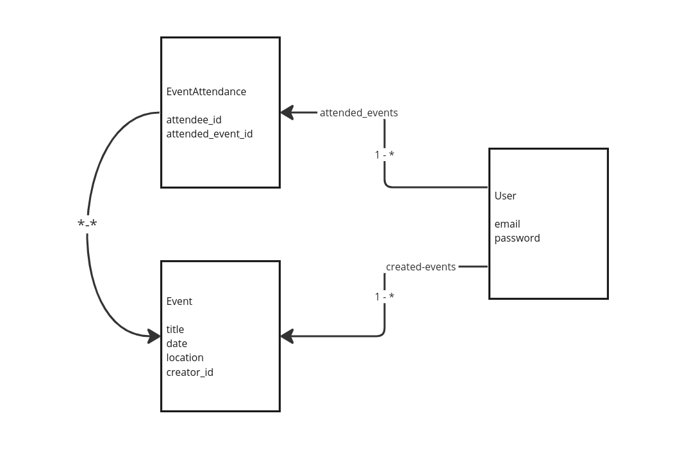
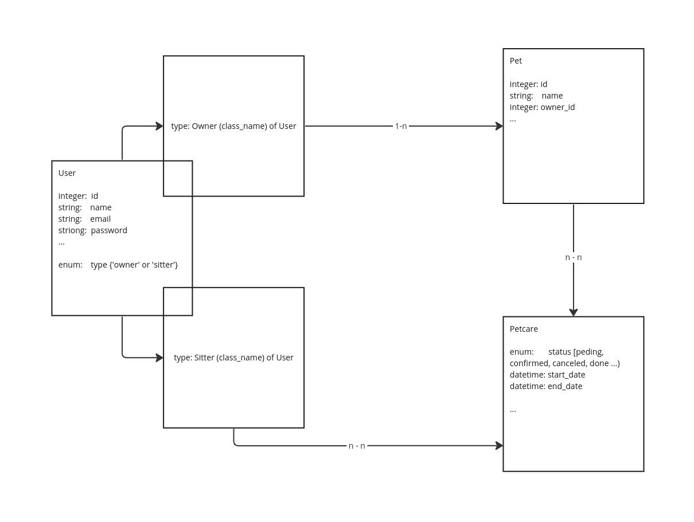
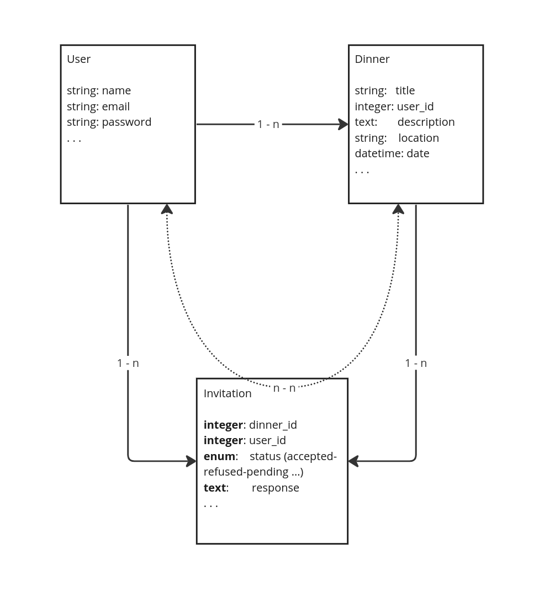
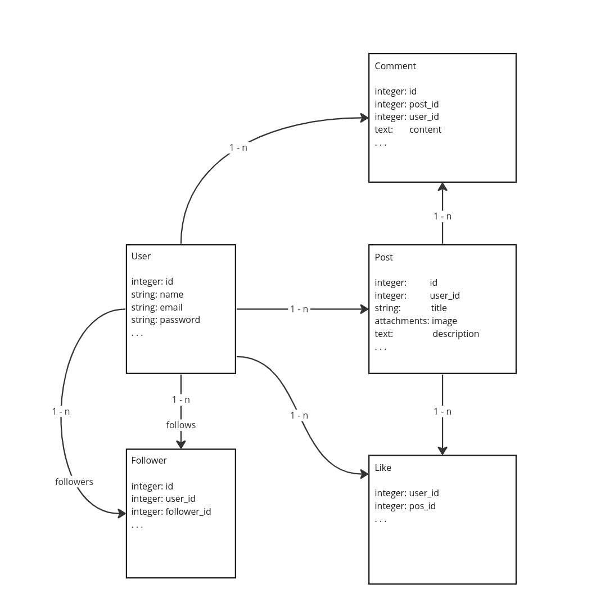

# Project: Private events
You want to build a site similar to a private Eventbrite which allows users to create events and then manage user signups.

A user can create events. A user can attend many events. An event can be attended by many users. Events take place at a specific date and at a location (which you can just store as a string, like “Andy’s House”).

* How to start the app
Clone the repository, go to the folder, open terminal and run this:
```console
bundle install && rails db:migrate && rails server
```

* Ruby version
3.2.2

* Database creation
This app use the sqlite the default db for rails to simplify the startup of the project

* Database initialization
```console
rails db:migrate db:seed
```

* How to run the test suite
```console
bundle exec rspec 
```

* Diagrame for the current app



# Warmup: thinking data first

## 1
A site for pet-sitting (watching someone’s pet while they’re gone). People can babysit for multiple pets and pets can have multiple petsitters.



## 2
You like hosting people for dinner so you want to build a dinner party invitation site. A user can create parties, invite people to a party, and accept an invitation to someone else’s party.



## 3 
Extra credit (tricky): You and your friends just love posting things and following each other. How would you set up the models so a user can follow another user?


